<div align="center">

<!-- ═══════════════════════════════════════════════════════════════════════ -->
<!-- ░░░░░░░░░░░░░  HEADER BANNER & RECRUITER HIGHLIGHTS  ░░░░░░░░░░░░░░░░░ -->
<!-- ═══════════════════════════════════════════════════════════════════════ -->



<br/>

<a href="https://git.io/typing-svg"></a>

<br/>

<!-- ═══════ SOCIAL BADGES ═══════ -->

<a href="https://linkedin.com/in/varun-s-41bb95357">
  
</a>
&nbsp;
<a href="https://github.com/Varun072006">
  
</a>
&nbsp;
<a href="https://leetcode.com/u/wYbMiQ6gOX">
  
</a>
&nbsp;
<a href="https://github.com/Varun072006">
  
</a>

</div>


<!-- ═══════════════════════════════════════════════════════════════════════ -->
<!-- ░░░░░░░░░░░░░░░░  ABOUT ME / EXECUTIVE SUMMARY  ░░░░░░░░░░░░░░░░░░░░░ -->
<!-- ═══════════════════════════════════════════════════════════════════════ -->

<div align="center">

## ⚡ `ABOUT_ME`

</div>

Computer Science undergraduate at **Bannari Amman Institute of Technology** (Class of 2028) specializing in **AI/ML Systems & Neural Architectures**. I focus on building production-ready intelligent applications — from **Graph Neural Networks** for temporal fraud detection to **LLM routing gateways** and **real-time computer vision pipelines**. Passionate about high-scale systems and currently seeking **AI/ML & Software Engineering Internships** at top-tier technology companies.

<br/>

<div align="center">


</div>


<!-- ═══════════════════════════════════════════════════════════════════════ -->
<!-- ░░░░░░░░░░░░░░░░  FEATURED PRODUCTION SYSTEMS  ░░░░░░░░░░░░░░░░░░░░░░░ -->
<!-- ═══════════════════════════════════════════════════════════════════════ -->

<div align="center">

## 🚀 `FEATURED_SYSTEMS`

<sub>High-impact AI/ML applications engineered for performance and real-world scale</sub>

</div>

<br/>

### 🔮 MuleNet.ai — Graph Neural Network Fraud Detection Engine

```bash
$ ./deploy MuleNet.ai --mode=production
══════════════════════════════════════════════════════════════════════════
 🔮 SYSTEM    Graph Neural Network Fraud Detection Engine
 ⚙️  STACK     Python · PyTorch Geometric · NetworkX · FastAPI · Docker
══════════════════════════════════════════════════════════════════════════
 ▸ Real-time transaction graph modeling & money laundering detection
 ▸ Temporal Graph Neural Network (T-GNN) architecture for node/edge anomaly scoring

   ╭──────────────────────────────────────────╮
   │  ROC-AUC SCORE .......... 0.96           │
   │  INFERENCE LATENCY ...... <45ms (RT)     │
   │  FALSE POSITIVE RED ..... -68%           │
   ╰──────────────────────────────────────────╯

 ▸ Microservice deployment with async event stream processing

 [████████████████████████████████████████] STATUS: DEPLOYED ✅
══════════════════════════════════════════════════════════════════════════
```

<br/>

### 🛡️ AegisNet.ai — LLM Routing & Multi-Model Orchestration Gateway

```bash
$ ./deploy AegisNet.ai --mode=production
══════════════════════════════════════════════════════════════════════════
 🛡️ SYSTEM    LLM Routing & Multi-Model Orchestration Gateway
 ⚙️  STACK     Python · TypeScript · Docker · Kubernetes · Prometheus
══════════════════════════════════════════════════════════════════════════
 ▸ Weighted routing, dynamic circuit breakers & automated provider failover

   ╭──────────────────────────────────────────╮
   │  FAILED REQUESTS ........ -73%           │
   │  THROUGHPUT ............. 100 req/s      │
   │  LATENCY OPTIMIZATION ... -35%           │
   ╰──────────────────────────────────────────╯

 ▸ Production observability integrated via OpenTelemetry + Prometheus

 [████████████████████████████████████████] STATUS: DEPLOYED ✅
══════════════════════════════════════════════════════════════════════════
```

<br/>

### 🚄 SonicRail.ai — AI-Powered Railway Hazard Detection

```bash
$ ./deploy SonicRail.ai --mode=production
══════════════════════════════════════════════════════════════════════════
 🚄 SYSTEM    AI-Powered Railway Hazard Detection (DAS Sensor Systems)
 ⚙️  STACK     Python · Flask · React · TensorFlow · CNN-BiLSTM · Docker
══════════════════════════════════════════════════════════════════════════
 ▸ Distributed Acoustic Sensing (DAS) time-series signal classification (5 hazard classes)

   ╭──────────────────────────────────────────╮
   │  F1-SCORE ............... 0.89           │
   │  INFERENCE .............. <2s (RT)       │
   │  GITHUB STARS ........... 54 ⭐          │
   ╰──────────────────────────────────────────╯

 ▸ Flask REST API + real-time React dashboard with streaming alerts

 [████████████████████████████████████████] STATUS: DEPLOYED ✅
══════════════════════════════════════════════════════════════════════════
```

<br/>

<details>
<summary><b>📂 View Additional Deployed Systems & Projects (Click to expand)</b></summary>
<br/>

#### 🎓 LearnQuest.ai — AI Learning & Secure Assessment Platform

```bash
$ ./deploy LearnQuest.ai --mode=production
══════════════════════════════════════════════════════════════════════════
 🎓 SYSTEM    AI Learning & Secure Assessment Platform
 ⚙️  STACK     React · Node.js · Express · MySQL · YOLOv5 · MediaPipe
══════════════════════════════════════════════════════════════════════════
 ▸ Serves 100+ concurrent users with JWT auth & Role-Based Access Control
 ▸ Integrated Judge0 + Monaco Editor supporting multi-language code execution
 ▸ Computer vision proctoring: real-time face detection, gaze tracking, phone detection

   ╭──────────────────────────────────────────╮
   │  DETECTION ACCURACY ..... 94%            │
   │  FALSE POSITIVES ........ <2%            │
   │  API RESPONSE TIME ...... <200ms         │
   ╰──────────────────────────────────────────╯

 [████████████████████████████████████████] STATUS: DEPLOYED ✅
══════════════════════════════════════════════════════════════════════════
```

<br/>

#### 📖 Adaptive Cognitive Reading Companion — Accessibility Platform

```bash
$ ./deploy AdaptiveCognitiveReadingCompanion.ai --mode=production
══════════════════════════════════════════════════════════════════════════
 📖 SYSTEM    Offline-First Accessibility Platform (Dyslexia / ADHD)
 ⚙️  STACK     Next.js · FastAPI · Llama 3 · BERT · PaddleOCR · Docker
══════════════════════════════════════════════════════════════════════════
 ▸ 100% local inference ensuring zero data leaves user device
 ▸ WCAG 2.1 AA compliant Chrome extension for reading assistance & text simplification

   ╭──────────────────────────────────────────╮
   │  OCR ACCURACY ........... 96%+           │
   │  USER SATISFACTION ...... 94%            │
   │  DOCUMENTS TESTED ....... 200+           │
   │  GITHUB STARS ........... 28 ⭐          │
   ╰──────────────────────────────────────────╯

 [████████████████████████████████████████] STATUS: DEPLOYED ✅
══════════════════════════════════════════════════════════════════════════
```

<br/>

#### 💻 AIPracticeHub.ai — Full-Stack Coding Platform

```bash
$ ./deploy AIPracticeHub.ai --mode=production
══════════════════════════════════════════════════════════════════════════
 💻 SYSTEM    Full-Stack Coding & Technical Assessment Platform
 ⚙️  STACK     React · Node.js · Express · TypeScript · MySQL · Docker
══════════════════════════════════════════════════════════════
 ▸ Sandboxed multi-language code execution via Judge0 microservices
 ▸ Optimized relational MySQL schema, REST APIs, and containerized Docker setup

 [████████████████████████████████████████] STATUS: DEPLOYED ✅
══════════════════════════════════════════════════════════════════════════
```

</details>

<br/>

<div align="center">
<sub>🔗 <b>Explore all repositories →</b> <a href="https://github.com/Varun072006?tab=repositories">github.com/Varun072006</a></sub>
</div>


<!-- ═══════════════════════════════════════════════════════════════════════ -->
<!-- ░░░░░░░░░░░░░░░░  TECHNICAL EXPERTISE & STACK  ░░░░░░░░░░░░░░░░░░░░ -->
<!-- ═══════════════════════════════════════════════════════════════════════ -->

<div align="center">

## 🛠️ `TECHNICAL_EXPERTISE`

<br/>

<table>
<tr><td align="center" width="96">
  <a href="#languages">
    
  </a>
  <br><sub><b>Python</b></sub>
</td>
<td align="center" width="96">
  <a href="#languages">
    
  </a>
  <br><sub><b>C++</b></sub>
</td>
<td align="center" width="96">
  <a href="#languages">
    
  </a>
  <br><sub><b>TypeScript</b></sub>
</td>
<td align="center" width="96">
  <a href="#languages">
    
  </a>
  <br><sub><b>JavaScript</b></sub>
</td>
<td align="center" width="96">
  <a href="#languages">
    
  </a>
  <br><sub><b>Java</b></sub>
</td>
<td align="center" width="96">
  <a href="#languages">
    
  </a>
  <br><sub><b>MySQL</b></sub>
</td>
<td align="center" width="96">
  <a href="#tools">
    
  </a>
  <br><sub><b>Docker</b></sub>
</td>
<td align="center" width="96">
  <a href="#tools">
    
  </a>
  <br><sub><b>Kubernetes</b></sub>
</td>
</tr>
</table>

<br/>

### 🧠 AI / ML & Deep Learning

<br/>


### 🌐 Systems & Full-Stack


### ☁️ Infrastructure & Cloud


</div>


<!-- ═══════════════════════════════════════════════════════════════════════ -->
<!-- ░░░░░░░░░░░░░░░░  COMPETITIONS & HACKATHONS  ░░░░░░░░░░░░░░░░░░░░░░░░░ -->
<!-- ═══════════════════════════════════════════════════════════════════════ -->

<div align="center">

## 🏆 `COMPETITIONS_&_HACKATHONS`

</div>

<div align="center">

| Competition | Domain / Focus Area |
|:---|:---|
| **Intellitrace 2026** | 🏦 AI-driven solutions for fintech & financial security |
| **ANZ Diversity Hackathon** | 🌏 National innovation challenge, ANZ |
| **AI for Bharat** | 📚 AI-powered educational accessibility & regional LLM systems |
| **AMD Slingshot** | ⚡ AI + High-Performance Computing (HPC) innovation |
| **Yuvaan by AVEVA** | 🏭 Industrial AI & digital twin transformation |

</div>


<!-- ═══════════════════════════════════════════════════════════════════════ -->
<!-- ░░░░░░░░░░░░░░░░  GITHUB ANALYTICS & METRICS  ░░░░░░░░░░░░░░░░░░░░░░░ -->
<!-- ═══════════════════════════════════════════════════════════════════════ -->

<div align="center">

## 📊 `GITHUB_ANALYTICS`

<br/>


&nbsp;&nbsp;


<br/><br/>


<br/><br/>


<br/><br/>


</div>


<!-- ═══════════════════════════════════════════════════════════════════════ -->
<!-- ░░░░░░░░░░░░░░░  3D CONTRIBUTION GRAPH & TROPHIES  ░░░░░░░░░░░░░░░░░░░ -->
<!-- ═══════════════════════════════════════════════════════════════════════ -->

<div align="center">

## 🌐 `3D_CONTRIBUTION_GRAPH`

<!--START_GRAPH-->

<!--END_GRAPH-->

<sub>🔄 Isometric render — auto-regenerated nightly via GitHub Actions</sub>

</div>


<div align="center">

## 🐍 `ACTIVITY_STREAM`

<br/>

<picture>
  <source media="(prefers-color-scheme: dark)" srcset="https://raw.githubusercontent.com/Varun072006/Varun072006/output/snake-matrix.svg" />
  <source media="(prefers-color-scheme: light)" srcset="https://raw.githubusercontent.com/Varun072006/Varun072006/output/snake-matrix.svg" />
  
</picture>

</div>


<div align="center">

## 🏅 `ACHIEVEMENTS_&_TROPHIES`

<br/>


</div>


<!-- ═══════════════════════════════════════════════════════════════════════ -->
<!-- ░░░░░░░░░░░░░░░░  CONNECT / FOOTER  ░░░░░░░░░░░░░░░░░░░░░░░░░░░░ -->
<!-- ═══════════════════════════════════════════════════════════════════════ -->

<div align="center">

## 📫 `CONNECT_&_COLLABORATE`

<br/>

<a href="https://www.linkedin.com/in/varun-s-41bb95357/">
  
</a>
&nbsp;&nbsp;
<a href="https://github.com/Varun072006?tab=repositories">
  
</a>
&nbsp;&nbsp;
<a href="https://leetcode.com/u/wYbMiQ6gOX">
  
</a>

<br/><br/>

<a href="https://git.io/typing-svg"></a>

<br/><br/>


<br/>


</div>
