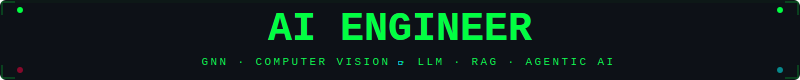

<div align="center">

<!-- ╔══════════════════════════════════════════════════════════════════════════╗ -->
<!-- ║                    NEURAL_OS — BOOT SEQUENCE HEADER                     ║ -->
<!-- ╚══════════════════════════════════════════════════════════════════════════╝ -->


<!-- ═══════ GLITCH EFFECT SVG ═══════ -->

<br/>



<br/><br/>

<!-- ═══════ BOOT SEQUENCE — PRIMARY TYPING ═══════ -->

<a href="https://git.io/typing-svg"></a>

<br/>

<!-- ═══════ BOOT SEQUENCE — SECONDARY TYPING ═══════ -->

<a href="https://git.io/typing-svg"></a>

<br/><br/>

<!-- ═══════ ACCESS PORT BADGES ═══════ -->

<a href="https://linkedin.com/in/varun-s-41bb95357">
  
</a>
&nbsp;
<a href="https://github.com/Varun072006">
  
</a>
&nbsp;
<a href="https://leetcode.com/u/wYbMiQ6gOX">
  
</a>
&nbsp;
<a href="https://github.com/Varun072006">
  
</a>

</div>

<!-- ╔══════════════════════════════════════════════════════════════════════════╗ -->
<!-- ║                         THREAT PROFILE — IDENTITY                       ║ -->
<!-- ╚══════════════════════════════════════════════════════════════════════════╝ -->


<div align="center">

##  &nbsp; `THREAT_PROFILE::IDENTITY` &nbsp; 

</div>

```
 ┌──────────────────────────────────────────────────────────────────────┐
 │                                                                      │
 │   $ whoami                                                           │
 │   ─────────────────────────────────────────────────────────────────   │
 │                                                                      │
 │   OPERATOR .............. Varun S                                    │
 │   CLASS ................. CSE — Bannari Amman Institute of Tech      │
 │   BUILD ................. 2024 – 2028 (CGPA 7.64/10)               │
 │   DIRECTIVE ............. Design, train, and deploy AI systems      │
 │   SPECIALIZATION ........ GNN · CV · LLM · RAG · Agentic AI        │
 │   MISSION ............... AI Engineer · SWE · Full-Stack Dev        │
 │   STATUS ................ 🟢 ONLINE & BUILDING                      │
 │                                                                      │
 │   $ cat /proc/neural/capabilities                                    │
 │   > 6 production systems deployed                                    │
 │   > Real users. Real impact. Real code.                             │
 │                                                                      │
 └──────────────────────────────────────────────────────────────────────┘
```

<div align="center">

```
 ⚡ OFFENSIVE CAPABILITIES                      🎯 CURRENT OPERATIONS
 ══════════════════════════════                  ══════════════════════════════
 🔮 GNN fraud detection engines                  🔭 Training GNNs on temporal graphs
 🧠 LLM routing & agentic systems                🌱 Exploring multi-agent orchestration
 📖 Offline-first accessibility tools             💼 Seeking AI/ML & SWE internships
 🚄 Real-time hazard detection (DAS)              🤝 Open to collaborations on GenAI
 💻 Full-stack AI-powered platforms               📫 Let's connect on LinkedIn!
```

<br/>

<a href="https://github.com/hackelite01/github-readme-cyber-quotes">
  
</a>

</div>

<!-- ╔══════════════════════════════════════════════════════════════════════════╗ -->
<!-- ║                       WEAPON SYSTEMS — TECH ARSENAL                     ║ -->
<!-- ╚══════════════════════════════════════════════════════════════════════════╝ -->


<div align="center">

##  &nbsp; `WEAPON_SYSTEMS::ARSENAL` &nbsp; 

<br/>

<a href="https://git.io/typing-svg"></a>

<br/><br/>

<!-- ═══════ ANIMATED TECH ICONS ═══════ -->

<table>
<tr><td align="center" width="96">
  <a href="#languages">
    
  </a>
  <br><sub><b>Python</b></sub>
</td>
<td align="center" width="96">
  <a href="#languages">
    
  </a>
  <br><sub><b>Java</b></sub>
</td>
<td align="center" width="96">
  <a href="#languages">
    
  </a>
  <br><sub><b>TypeScript</b></sub>
</td>
<td align="center" width="96">
  <a href="#languages">
    
  </a>
  <br><sub><b>JavaScript</b></sub>
</td>
<td align="center" width="96">
  <a href="#languages">
    
  </a>
  <br><sub><b>C++</b></sub>
</td>
<td align="center" width="96">
  <a href="#languages">
    
  </a>
  <br><sub><b>MySQL</b></sub>
</td>
<td align="center" width="96">
  <a href="#tools">
    
  </a>
  <br><sub><b>Docker</b></sub>
</td>
<td align="center" width="96">
  <a href="#tools">
    
  </a>
  <br><sub><b>Kubernetes</b></sub>
</td>
</tr>
</table>

<br/>

<!-- ═══════ NEURAL CORES (AI/ML) ═══════ -->

### 🧠 `NEURAL_CORES` — AI / ML / Deep Learning


<br/>


<br/>

### ⚔️ `ATTACK_VECTORS` — Full-Stack Development


<br/>

### 🛡️ `DEFENSE_GRID` — Cloud & DevOps


<br/>

</div>

<!-- ╔══════════════════════════════════════════════════════════════════════════╗ -->
<!-- ║                     DEPLOYED EXPLOITS — MISSION LOG                     ║ -->
<!-- ╚══════════════════════════════════════════════════════════════════════════╝ -->


<div align="center">

##  &nbsp; `DEPLOYED_EXPLOITS::MISSION_LOG` &nbsp; 

<br/>

<a href="https://git.io/typing-svg"></a>

</div>

<br/>

<details>
<summary>🔒 <b><code>EXPLOIT_001</code></b> — 🔮 <b>MuleNet.ai</b> — Graph Neural Network Fraud Detection Engine</summary>
<br/>

```bash
$ ./deploy MuleNet.ai --mode=production --clearance=TOP_SECRET
══════════════════════════════════════════════════════════════
 🔮 SYSTEM    Graph Neural Network Fraud Detection Engine
 ⚙️  STACK     Python · PyTorch · PyG (PyTorch Geometric) · FastAPI · Neo4j
══════════════════════════════════════════════════════════════
 ▸ Multi-graph attention network on temporal transaction graphs
 ▸ Node classification + link prediction for financial fraud detection
 ▸ Real-time inference pipeline with sub-second latency
 ▸ Graph-based feature engineering with temporal aggregation

   ╭──────────────────────────────────────╮
   │  MODEL AUC-ROC ....... 0.96         │
   │  PRECISION ........... 94%          │
   │  INFERENCE TIME ...... <500ms       │
   ╰──────────────────────────────────────╯

 ▸ FastAPI serving layer + Neo4j graph database
 ▸ Docker containerized deployment pipeline

 [████████████████████████████████████████] STATUS: DEPLOYED ✅
══════════════════════════════════════════════════════════════
```
</details>

<details>
<summary>🔒 <b><code>EXPLOIT_002</code></b> — 🎓 <b>LearnQuest.ai</b> — AI Learning & Secure Assessment Platform</summary>
<br/>

```bash
$ ./deploy LearnQuest.ai --mode=production --clearance=SECRET
══════════════════════════════════════════════════════════════
 🎓 SYSTEM    AI Learning & Secure Assessment Platform
 ⚙️  STACK     React · Node.js · Express · MySQL · YOLOv5 · MediaPipe
══════════════════════════════════════════════════════════════
 ▸ Serves 100+ concurrent users, JWT auth + RBAC
 ▸ Judge0 + Monaco Editor => 10+ languages, sandboxed execution
 ▸ AI proctoring: face detection, gaze tracking, phone detection

   ╭──────────────────────────────────────╮
   │  DETECTION ACCURACY .... 94%        │
   │  FALSE POSITIVES ....... <2%        │
   │  API RESPONSE TIME ..... <200ms     │
   ╰──────────────────────────────────────╯

 ▸ Indexed queries + CI/CD pipeline

 [████████████████████████████████████████] STATUS: DEPLOYED ✅
══════════════════════════════════════════════════════════════
```
</details>

<details>
<summary>🔒 <b><code>EXPLOIT_003</code></b> — 🚄 <b>SonicRail.ai</b> — AI-Powered Railway Hazard Detection</summary>
<br/>

```bash
$ ./deploy SonicRail.ai --mode=production --clearance=SECRET
══════════════════════════════════════════════════════════════
 🚄 SYSTEM    AI-Powered Railway Hazard Detection
 ⚙️  STACK     Python · Flask · React · TensorFlow · CNN-BiLSTM · Docker
══════════════════════════════════════════════════════════════
 ▸ DAS time-series data · 10,000+ synthetic samples · 5 hazard classes

   ╭──────────────────────────────────────╮
   │  F1-SCORE ........... 0.89          │
   │  INFERENCE .......... <2s (RT)      │
   │  GITHUB STARS ....... 54 ⭐         │
   ╰──────────────────────────────────────╯

 ▸ Flask API + React dashboard, live monitoring & alert streaming
 ▸ LIVE DEPLOYMENT: ACTIVE

 [████████████████████████████████████████] STATUS: DEPLOYED ✅
══════════════════════════════════════════════════════════════
```
</details>

<details>
<summary>🔒 <b><code>EXPLOIT_004</code></b> — 📖 <b>Adaptive Cognitive Reading Companion</b> — Accessibility Platform</summary>
<br/>

```bash
$ ./deploy ACRC.ai --mode=production --clearance=SECRET
══════════════════════════════════════════════════════════════
 📖 SYSTEM    Offline-First Accessibility Platform (dyslexia/ADHD)
 ⚙️  STACK     Next.js · FastAPI · Llama 3 · BERT · PaddleOCR · Docker
══════════════════════════════════════════════════════════════
 ▸ 100% local inference — zero data leaves device

   ╭──────────────────────────────────────╮
   │  OCR ACCURACY ........ 96%+         │
   │  USER SATISFACTION ... 94%          │
   │  DOCUMENTS TESTED .... 200+         │
   │  GITHUB STARS ........ 28 ⭐        │
   ╰──────────────────────────────────────╯

 ▸ WCAG 2.1 AA compliant · Published as Chrome extension

 [████████████████████████████████████████] STATUS: DEPLOYED ✅
══════════════════════════════════════════════════════════════
```
</details>

<details>
<summary>🔒 <b><code>EXPLOIT_005</code></b> — 🛡️ <b>AegisNet.ai</b> — LLM Routing & Multi-Model Orchestration Gateway</summary>
<br/>

```bash
$ ./deploy AegisNet.ai --mode=production --clearance=TOP_SECRET
══════════════════════════════════════════════════════════════
 🛡️ SYSTEM    LLM Routing & Multi-Model Orchestration Gateway
 ⚙️  STACK     Python · TypeScript · Docker · Kubernetes · Prometheus
══════════════════════════════════════════════════════════════
 ▸ Weighted routing, circuit breakers, automated failover
   across multiple AI providers

   ╭──────────────────────────────────────╮
   │  FAILED REQUESTS ....... -73%       │
   │  THROUGHPUT ............ 100 req/s  │
   ╰──────────────────────────────────────╯

 ▸ Observability via OpenTelemetry + Prometheus

 [████████████████████████████████████████] STATUS: DEPLOYED ✅
══════════════════════════════════════════════════════════════
```
</details>

<details>
<summary>🔒 <b><code>EXPLOIT_006</code></b> — 💻 <b>AIPracticeHub.ai</b> — Full-Stack Coding Platform</summary>
<br/>

```bash
$ ./deploy AIPracticeHub.ai --mode=production --clearance=SECRET
══════════════════════════════════════════════════════════════
 💻 SYSTEM    Full-Stack Coding Platform
 ⚙️  STACK     React · Node.js · Express · TypeScript · MySQL · Docker
══════════════════════════════════════════════════════════════
 ▸ JWT auth + RBAC · Automated code evaluation
 ▸ Judge0 integration => compile/execute across 10+ languages
 ▸ Optimized REST APIs + MySQL schema · Admin dashboard
 ▸ Docker Compose deployment

 [████████████████████████████████████████] STATUS: DEPLOYED ✅
══════════════════════════════════════════════════════════════
```
</details>

<br/>

<div align="center">
<sub>🔗 <b>Full source code →</b> <a href="https://github.com/Varun072006?tab=repositories">github.com/Varun072006/repositories</a></sub>
</div>

<!-- ╔══════════════════════════════════════════════════════════════════════════╗ -->
<!-- ║                       INTERCEPT LOG — OPERATIONS                        ║ -->
<!-- ╚══════════════════════════════════════════════════════════════════════════╝ -->


<div align="center">

## 🏆 &nbsp; `INTERCEPT_LOG::OPERATIONS` &nbsp; 🏆

<br/>

| 🔒 OPERATION | 🎯 MISSION OBJECTIVE | 📊 STATUS |
|:---|:---|:---:|
| **`INTELLITRACE_2026`** | 🏦 AI-driven solutions for fintech & banking | `COMPLETED` |
| **`ANZ_DIVERSITY`** | 🌏 National innovation challenge, ANZ | `COMPLETED` |
| **`AI_FOR_BHARAT`** | 📚 AI-powered educational accessibility | `COMPLETED` |
| **`AMD_SLINGSHOT`** | ⚡ AI + HPC innovation challenge | `COMPLETED` |
| **`YUVAAN_AVEVA`** | 🏭 Industrial AI & digital transformation | `COMPLETED` |

</div>

<!-- ╔══════════════════════════════════════════════════════════════════════════╗ -->
<!-- ║                        ACCESS KEYS — CLEARANCE                          ║ -->
<!-- ╚══════════════════════════════════════════════════════════════════════════╝ -->


<div align="center">

## 🔑 &nbsp; `ACCESS_KEYS::CLEARANCE` &nbsp; 🔑

<br/>


<br/>


</div>

<!-- ╔══════════════════════════════════════════════════════════════════════════╗ -->
<!-- ║                      NEURAL TELEMETRY — LIVE FEED                       ║ -->
<!-- ╚══════════════════════════════════════════════════════════════════════════╝ -->


<div align="center">

##  &nbsp; `NEURAL_TELEMETRY::LIVE_FEED` &nbsp; 

<br/>

<a href="https://git.io/typing-svg"></a>

<br/><br/>


&nbsp;&nbsp;


<br/><br/>


<br/><br/>


<br/><br/>


</div>

<!-- ╔══════════════════════════════════════════════════════════════════════════╗ -->
<!-- ║                      HOLOGRAPHIC RENDER — 3D MATRIX                     ║ -->
<!-- ╚══════════════════════════════════════════════════════════════════════════╝ -->


<div align="center">

## 🌐 &nbsp; `HOLOGRAPHIC_RENDER::3D_MATRIX` &nbsp; 🌐

<br/>

<!--START_GRAPH-->

<!--END_GRAPH-->

<sub>🔄 Isometric hologram — auto-regenerated nightly via <code>.github/workflows/profile-3d-contrib.yml</code></sub>

</div>

<!-- ╔══════════════════════════════════════════════════════════════════════════╗ -->
<!-- ║                    DATA BREACH — PACKET CAPTURE                         ║ -->
<!-- ╚══════════════════════════════════════════════════════════════════════════╝ -->


<div align="center">

## 🐍 &nbsp; `DATA_BREACH::PACKET_CAPTURE` &nbsp; 🐍

<br/>

<a href="https://git.io/typing-svg"></a>

<br/><br/>

<picture>
  <source media="(prefers-color-scheme: dark)" srcset="https://raw.githubusercontent.com/Varun072006/Varun072006/output/snake-matrix.svg" />
  <source media="(prefers-color-scheme: light)" srcset="https://raw.githubusercontent.com/Varun072006/Varun072006/output/snake-matrix.svg" />
  
</picture>

</div>

<!-- ╔══════════════════════════════════════════════════════════════════════════╗ -->
<!-- ║                       TROPHY VAULT — ACHIEVEMENTS                       ║ -->
<!-- ╚══════════════════════════════════════════════════════════════════════════╝ -->


<div align="center">

## 🏅 &nbsp; `TROPHY_VAULT::ACHIEVEMENTS` &nbsp; 🏅

<br/>


</div>

<!-- ╔══════════════════════════════════════════════════════════════════════════╗ -->
<!-- ║                    SIGNAL INTERCEPT — OPEN CHANNEL                      ║ -->
<!-- ╚══════════════════════════════════════════════════════════════════════════╝ -->


<div align="center">

##  &nbsp; `SIGNAL_INTERCEPT::OPEN_CHANNEL` &nbsp; 

<br/>

<a href="https://www.linkedin.com/in/varun-s-41bb95357/">
  
</a>
&nbsp;&nbsp;
<a href="https://github.com/Varun072006?tab=repositories">
  
</a>
&nbsp;&nbsp;
<a href="https://leetcode.com/u/wYbMiQ6gOX">
  
</a>

<br/><br/>

<a href="https://git.io/typing-svg"></a>

<br/><br/>

```
 ╔══════════════════════════════════════════════════════════════╗
 ║                                                              ║
 ║   > session_type: ENCRYPTED_CHANNEL                         ║
 ║   > uptime: 99.99%                                          ║
 ║   > threat_level: [ NONE DETECTED ]                         ║
 ║   > next_operation: IN_PROGRESS...                          ║
 ║                                                              ║
 ║   ⚡ "I don't just write code — I architect systems         ║
 ║      that think, learn, and scale."                          ║
 ║                                                              ║
 ║   CONNECTION STATUS: AWAITING_YOUR_INPUT █                  ║
 ║                                                              ║
 ╚══════════════════════════════════════════════════════════════╝
```

<br/>


</div>
