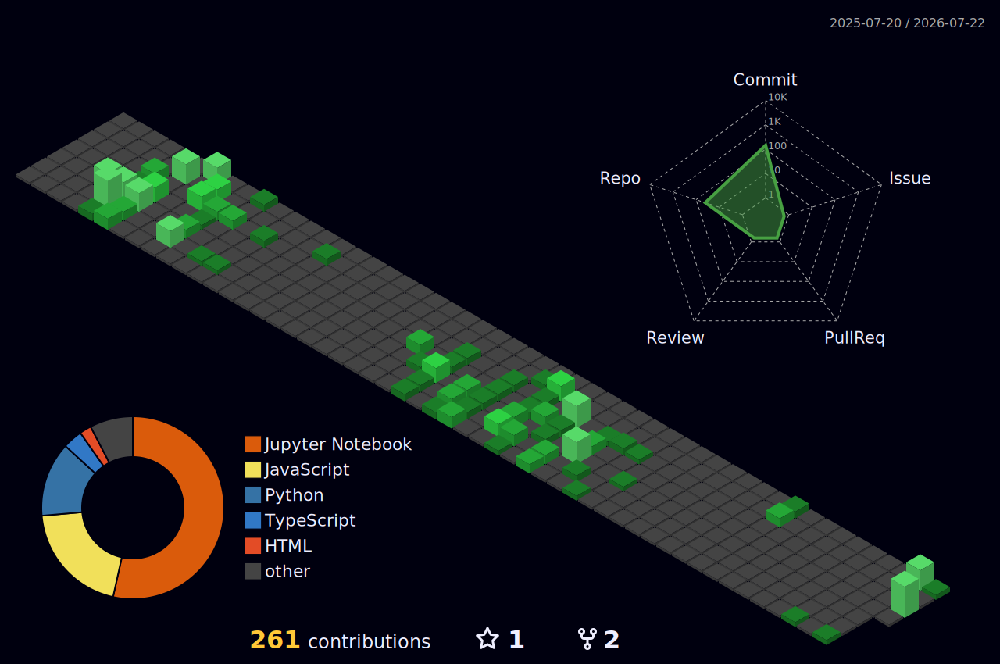

<div align="center">

<!-- ═══════════════════════════════════════════════════════════════════════ -->
<!-- ░░░░░░░░░░░░░  ANIMATED WAVING HEADER WITH 3D DEPTH  ░░░░░░░░░░░░░░ -->
<!-- ═══════════════════════════════════════════════════════════════════════ -->


<!-- ═══════ TERMINAL BADGE BANNER ═══════ -->




<!-- ═══════ ANIMATED TYPING TERMINAL SEQUENCE ═══════ -->

<br/>

<a href="https://git.io/typing-svg"></a>

<br/>

<a href="https://git.io/typing-svg"></a>

<br/><br/>

<!-- ═══════ SOCIAL BADGES WITH GLOW EFFECT ═══════ -->

<a href="https://linkedin.com/in/varun-s-41bb95357">
  
</a>
&nbsp;
<a href="https://github.com/Varun072006">
  
</a>
&nbsp;
<a href="https://leetcode.com/u/wYbMiQ6gOX">
  
</a>
&nbsp;
<a href="https://github.com/Varun072006">
  
</a>

</div>

<!-- ═══════════════════════════════════════════════════════════════════════ -->
<!-- ░░░░░░░░░░░░░░░░  ANIMATED DIVIDER  ░░░░░░░░░░░░░░░░░░░░░░░░░░░░░░ -->
<!-- ═══════════════════════════════════════════════════════════════════════ -->


<!-- ═══════════════════════════════════════════════════════════════════════ -->
<!-- ░░░░░░░░░░░░░░░░  TECH STACK — ANIMATED GRID  ░░░░░░░░░░░░░░░░░░░░ -->
<!-- ═══════════════════════════════════════════════════════════════════════ -->

<div align="center">

##  &nbsp; `MODULE::TECH_STACK` &nbsp; 

<br/>

<table>
<tr><td align="center" width="96">
  <a href="#languages">
    
  </a>
  <br><sub><b>Python</b></sub>
</td>
<td align="center" width="96">
  <a href="#languages">
    
  </a>
  <br><sub><b>Java</b></sub>
</td>
<td align="center" width="96">
  <a href="#languages">
    
  </a>
  <br><sub><b>TypeScript</b></sub>
</td>
<td align="center" width="96">
  <a href="#languages">
    
  </a>
  <br><sub><b>JavaScript</b></sub>
</td>
<td align="center" width="96">
  <a href="#languages">
    
  </a>
  <br><sub><b>C++</b></sub>
</td>
<td align="center" width="96">
  <a href="#languages">
    
  </a>
  <br><sub><b>MySQL</b></sub>
</td>
<td align="center" width="96">
  <a href="#tools">
    
  </a>
  <br><sub><b>Docker</b></sub>
</td>
<td align="center" width="96">
  <a href="#tools">
    
  </a>
  <br><sub><b>Kubernetes</b></sub>
</td>
</tr>
</table>

<br/>

### 🧠 AI / ML / Deep Learning

<br/>


### 🌐 Full-Stack Development


### ☁️ Cloud & DevOps


<br/>

</div>

<div align="center">



</div>


<!-- ═══════════════════════════════════════════════════════════════════════ -->
<!-- ░░░░░░░░░░░░░░░  NEURAL SYSTEMS DEPLOYED  ░░░░░░░░░░░░░░░░░░░░░░░░ -->
<!-- ═══════════════════════════════════════════════════════════════════════ -->

<div align="center">

##  &nbsp; `MODULE::DEPLOYED_SYSTEMS` &nbsp; 

<br/>

<a href="https://git.io/typing-svg"></a>

</div>

<br/>

<details>
<summary><b>🔮 MuleNet.ai — Graph Neural Network Fraud Detection Engine</b></summary>
<br/>

══════════════════════════════════════════════════════════════
```
</details>

<details>
<summary><b>🎓 LearnQuest.ai — AI Learning & Secure Assessment Platform</b></summary>
<br/>

```bash
$ ./deploy LearnQuest.ai --mode=production
══════════════════════════════════════════════════════════════
 🎓 SYSTEM    AI Learning & Secure Assessment Platform
 ⚙️  STACK     React · Node.js · Express · MySQL · YOLOv5 · MediaPipe
══════════════════════════════════════════════════════════════
 ▸ Serves 100+ concurrent users, JWT auth + RBAC
 ▸ Judge0 + Monaco Editor => 10+ languages, sandboxed execution
 ▸ AI proctoring: face detection, gaze tracking, phone detection

   ╭──────────────────────────────────────╮
   │  DETECTION ACCURACY .... 94%        │
   │  FALSE POSITIVES ....... <2%        │
   │  API RESPONSE TIME ..... <200ms     │
   ╰──────────────────────────────────────╯

 ▸ Indexed queries + CI/CD pipeline

 [████████████████████████████████████████] STATUS: DEPLOYED ✅
══════════════════════════════════════════════════════════════
```
</details>

<details>
<summary><b>🚄 SonicRail.ai — AI-Powered Railway Hazard Detection</b></summary>
<br/>

```bash
$ ./deploy SonicRail.ai --mode=production
══════════════════════════════════════════════════════════════
 🚄 SYSTEM    AI-Powered Railway Hazard Detection
 ⚙️  STACK     Python · Flask · React · TensorFlow · CNN-BiLSTM · Docker
══════════════════════════════════════════════════════════════
 ▸ DAS time-series data · 10,000+ synthetic samples · 5 hazard classes

   ╭──────────────────────────────────────╮
   │  F1-SCORE ........... 0.89          │
   │  INFERENCE .......... <2s (RT)      │
   │  GITHUB STARS ....... 54 ⭐         │
   ╰──────────────────────────────────────╯

 ▸ Flask API + React dashboard, live monitoring & alert streaming
 ▸ LIVE DEPLOYMENT: ACTIVE

 [████████████████████████████████████████] STATUS: DEPLOYED ✅
══════════════════════════════════════════════════════════════
```
</details>

<details>
<summary><b>📖 Adaptive Cognitive Reading Companion — Accessibility Platform</b></summary>
<br/>

```bash
$ ./deploy AdaptiveCognitiveReadingCompanion.ai --mode=production
══════════════════════════════════════════════════════════════
 📖 SYSTEM    Offline-First Accessibility Platform (dyslexia/ADHD)
 ⚙️  STACK     Next.js · FastAPI · Llama 3 · BERT · PaddleOCR · Docker
══════════════════════════════════════════════════════════════
 ▸ 100% local inference — zero data leaves device

   ╭──────────────────────────────────────╮
   │  OCR ACCURACY ........ 96%+         │
   │  USER SATISFACTION ... 94%          │
   │  DOCUMENTS TESTED .... 200+         │
   │  GITHUB STARS ........ 28 ⭐        │
   ╰──────────────────────────────────────╯

 ▸ WCAG 2.1 AA compliant · Published as Chrome extension

 [████████████████████████████████████████] STATUS: DEPLOYED ✅
══════════════════════════════════════════════════════════════
```
</details>

<details>
<summary><b>🛡️ AegisNet.ai — LLM Routing & Multi-Model Orchestration Gateway</b></summary>
<br/>

```bash
$ ./deploy AegisNet.ai --mode=production
══════════════════════════════════════════════════════════════
 🛡️ SYSTEM    LLM Routing & Multi-Model Orchestration Gateway
 ⚙️  STACK     Python · TypeScript · Docker · Kubernetes · Prometheus
══════════════════════════════════════════════════════════════
 ▸ Weighted routing, circuit breakers, automated failover
   across multiple AI providers

   ╭──────────────────────────────────────╮
   │  FAILED REQUESTS ....... -73%       │
   │  THROUGHPUT ............ 100 req/s  │
   ╰──────────────────────────────────────╯

 ▸ Observability via OpenTelemetry + Prometheus

 [████████████████████████████████████████] STATUS: DEPLOYED ✅
══════════════════════════════════════════════════════════════
```
</details>

<details>
<summary><b>💻 AIPracticeHub.ai — Full-Stack Coding Platform</b></summary>
<br/>

```bash
$ ./deploy AIPracticeHub.ai --mode=production
══════════════════════════════════════════════════════════════
 💻 SYSTEM    Full-Stack Coding Platform
 ⚙️  STACK     React · Node.js · Express · TypeScript · MySQL · Docker
══════════════════════════════════════════════════════════════
 ▸ JWT auth + RBAC · Automated code evaluation
 ▸ Judge0 integration => compile/execute across 10+ languages
 ▸ Optimized REST APIs + MySQL schema · Admin dashboard
 ▸ Docker Compose deployment

 [████████████████████████████████████████] STATUS: DEPLOYED ✅
══════════════════════════════════════════════════════════════
```
</details>

<br/>

<div align="center">
<sub>🔗 <b>Full source code →</b> <a href="https://github.com/Varun072006?tab=repositories">github.com/Varun072006/repositories</a></sub>
</div>


<!-- ═══════════════════════════════════════════════════════════════════════ -->
<!-- ░░░░░░░░░░░░░░░░  COMPETITION & HACKATHON LOG  ░░░░░░░░░░░░░░░░░░░ -->
<!-- ═══════════════════════════════════════════════════════════════════════ -->

<div align="center">

## 🏆 &nbsp; `MODULE::BATTLE_LOG` &nbsp; 🏆

</div>

<div align="center">

| Competition | Domain |
|:---|:---|
| **Intellitrace 2026** | 🏦 AI-driven solutions for fintech & banking |
| **ANZ Diversity Hackathon** | 🌏 National innovation challenge, ANZ |
| **AI for Bharat** | 📚 AI-powered educational accessibility |
| **AMD Slingshot** | ⚡ AI + HPC innovation challenge |
| **Yuvaan by AVEVA** | 🏭 Industrial AI & digital transformation |

</div>


<!-- ═══════════════════════════════════════════════════════════════════════ -->
<!-- ░░░░░░░░░░░░░░░░  CERTIFICATIONS  ░░░░░░░░░░░░░░░░░░░░░░░░░░░░░░░ -->
<!-- ═══════════════════════════════════════════════════════════════════════ -->

<div align="center">

## 🔑 &nbsp; `MODULE::CERTIFICATION_KEYS` &nbsp; 🔑

<br/>


<br/>


</div>


<!-- ═══════════════════════════════════════════════════════════════════════ -->
<!-- ░░░░░░░░░░░░░░░░  LIVE TELEMETRY — STATS  ░░░░░░░░░░░░░░░░░░░░░░░ -->
<!-- ═══════════════════════════════════════════════════════════════════════ -->

<div align="center">

##  &nbsp; `MODULE::LIVE_TELEMETRY` &nbsp; 

<br/>


&nbsp;&nbsp;


<br/><br/>


<br/><br/>


<br/><br/>


</div>


<!-- ═══════════════════════════════════════════════════════════════════════ -->
<!-- ░░░░░░░░░░░░░░░  3D CONTRIBUTION GRAPH  ░░░░░░░░░░░░░░░░░░░░░░░░░ -->
<!-- ═══════════════════════════════════════════════════════════════════════ -->

<div align="center">

## 🌐 &nbsp; `MODULE::3D_CORE_RENDER` &nbsp; 🌐

<!--START_GRAPH-->

<!--END_GRAPH-->

<sub>🔄 Isometric render — auto-regenerated nightly via <code>.github/workflows/profile-3d-contrib.yml</code></sub>

</div>


<!-- ═══════════════════════════════════════════════════════════════════════ -->
<!-- ░░░░░░░░░░░░░░░░  CONTRIBUTION SNAKE  ░░░░░░░░░░░░░░░░░░░░░░░░░░░ -->
<!-- ═══════════════════════════════════════════════════════════════════════ -->

<div align="center">

## 🐍 &nbsp; `MODULE::DATA_STREAM` &nbsp; 🐍

<br/>

<picture>
  <source media="(prefers-color-scheme: dark)" srcset="https://raw.githubusercontent.com/Varun072006/Varun072006/output/snake-matrix.svg" />
  <source media="(prefers-color-scheme: light)" srcset="https://raw.githubusercontent.com/Varun072006/Varun072006/output/snake-matrix.svg" />
  
</picture>

</div>


<!-- ═══════════════════════════════════════════════════════════════════════ -->
<!-- ░░░░░░░░░░░░░░░  GITHUB TROPHIES  ░░░░░░░░░░░░░░░░░░░░░░░░░░░░░░ -->
<!-- ═══════════════════════════════════════════════════════════════════════ -->

<div align="center">

## 🏅 &nbsp; `MODULE::TROPHY_CASE` &nbsp; 🏅

<br/>


</div>


<!-- ═══════════════════════════════════════════════════════════════════════ -->
<!-- ░░░░░░░░░░░░░░░░  CONNECT / FOOTER  ░░░░░░░░░░░░░░░░░░░░░░░░░░░░ -->
<!-- ═══════════════════════════════════════════════════════════════════════ -->

<div align="center">

##  &nbsp; `MODULE::OPEN_CHANNEL` &nbsp; 

<br/>

<a href="https://www.linkedin.com/in/varun-s-41bb95357/">
  
</a>
&nbsp;&nbsp;
<a href="https://github.com/Varun072006?tab=repositories">
  
</a>
&nbsp;&nbsp;
<a href="https://leetcode.com/u/wYbMiQ6gOX">
  
</a>

<br/><br/>

<a href="https://git.io/typing-svg"></a>

<br/><br/>



<br/>


</div>
